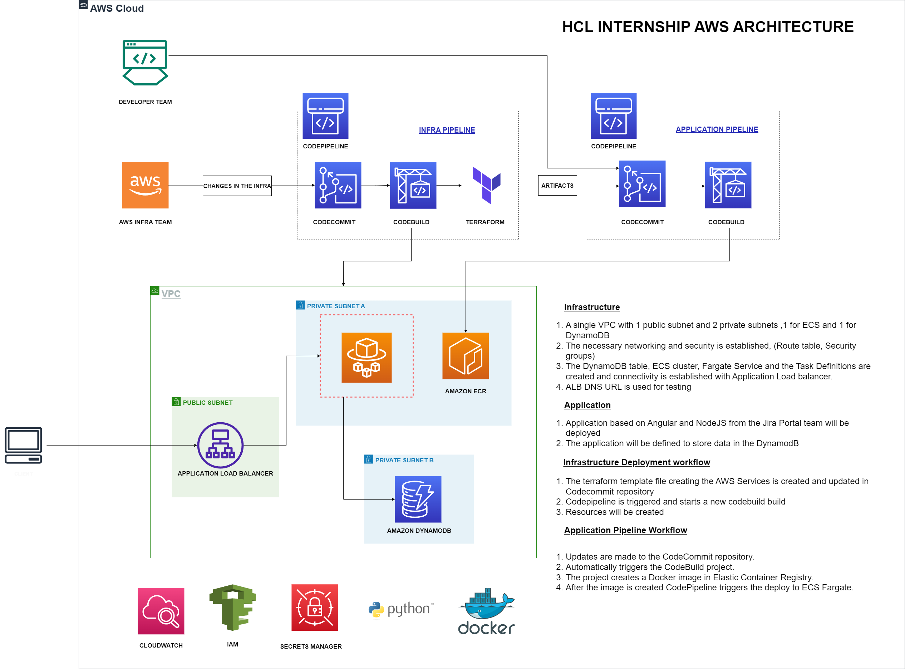

# HCI AWS — Cloud Internship DevOps Project

*AWS DevOps Internship | April 2023 – July 2023*

A complete two-pipeline CI/CD project built during a Cloud/DevOps internship: a Terraform-driven **infrastructure pipeline** provisions a full 3-tier AWS environment, and a separate **application pipeline** builds, containerizes, and deploys a Jira-style tracking application into it.


## Overview

| | |
|---|---|
| **Program** | AWS DevOps Cloud Internship |
| **Duration** | April 2023 – July 2023 |
| **Capability** | End-to-end infra + application CI/CD on AWS |
| **Technology used** | Terraform, AWS CodePipeline/CodeCommit/CodeBuild, ECS, ECR, DynamoDB, ALB, Auto Scaling |
| **Application deployed** | A Jira-style sprint/story tracking app (Angular frontend + backend service) |

## Architecture



Two independent pipelines feed into one shared VPC:

- **Infra Pipeline** — CodeCommit → CodeBuild → Terraform, provisions/updates all AWS infrastructure.
- **Application Pipeline** — CodeCommit → CodeBuild, builds a Docker image, pushes to ECR, and deploys to ECS.

Full breakdown of the use case, tech stack, and both pipeline workflows: [`docs/use-case-overview.md`](docs/use-case-overview.md)

## What Gets Built

- **VPC** with 1 public subnet and 2 private subnets, across two Availability Zones
- **Internet Gateway + NAT Gateway**, with route tables wired correctly for public/private traffic
- **Security groups** scoping traffic between the ALB and the application tier
- **Application Load Balancer**, with path-based routing: `/jiraportal/*` → frontend, `/service/*` → backend
- **Two ECS clusters** (frontend, backend) with task definitions and services
- **Two Auto Scaling Groups + Launch Templates**, one per tier, with scheduled scale-up/scale-down (business hours, IST)
- **Two ECR repositories**, one per tier, for container images
- **Two DynamoDB tables** — `PlannedStoryPoints` (sprint/story data) and `UserDetails` (application users)
- **Environment-driven configuration** — the same Terraform code deploys to `dev` or `prod` via `dev.tfvars` / `prod.tfvars`

## Repository Contents

```
hci-aws-devops-internship/
├── infra/
│   ├── providers.tf                # Terraform backend (S3) + version constraint
│   ├── variables.tf                # environment, region, ecr_env, execution_role_arn
│   ├── dev.tfvars / prod.tfvars    # Per-environment variable values
│   ├── vpc.tf                      # VPC
│   ├── subnets.tf                  # 2 public + 2 private subnets
│   ├── igw.tf / ngw.tf             # Internet Gateway, NAT Gateway + EIP
│   ├── rt.tf / rt_associate.tf     # Route tables + associations
│   ├── sg.tf                       # ALB + EC2 security groups and rules
│   ├── asg.tf                      # Auto Scaling Groups, Launch Templates, schedules
│   ├── lb.tf                       # ALB, listener, path-based routing rules, target groups
│   ├── ecr.tf                      # ECR repositories (frontend, backend)
│   ├── ecs.tf                      # ECS clusters, task definitions, services
│   ├── *_taskdef.json              # ECS task definitions (frontend/backend)
│   ├── dbb.tf / dbt2.tf            # DynamoDB tables (PlannedStoryPoints, UserDetails)
│   ├── buildspec.yaml              # CodeBuild: terraform init/plan/apply
│   ├── validate.yaml               # CodeBuild: terraform validate (PR/branch checks)
│   ├── user_data_frontend.sh       # EC2 bootstrap — registers with the frontend ECS cluster
│   ├── user_data_backend.sh        # EC2 bootstrap — registers with the backend ECS cluster
│   └── rule.html                   # ALB default fixed-response page (503)
├── architecture/
│   └── architecture.png            # Solution architecture diagram
└── docs/
    └── use-case-overview.md        # Use case, tech stack, and pipeline workflows in detail
```

> **Note:** AWS Account IDs, the EC2 key pair name, and a seeded test-user email have been replaced with placeholders throughout. Everything else reflects the actual internship build.

## Deploying

```bash
cd infra/
terraform init
terraform plan -var-file="dev.tfvars"
terraform apply -var-file="dev.tfvars" -auto-approve
```

In practice this ran inside AWS CodeBuild via `buildspec.yaml`, triggered automatically by CodePipeline on every push to the infra CodeCommit repository — see [`docs/use-case-overview.md`](docs/use-case-overview.md#two-pipelines) for the full trigger flow.

## Prerequisites

- AWS account with credentials configured
- An S3 bucket for the Terraform backend (configured in `providers.tf`)
- An existing IAM role for ECS task execution (`execution_role_arn` in `variables.tf`)
- An existing EC2 key pair (referenced in `asg.tf`)
- Terraform 1.1.8 (as pinned in the CodeBuild install phase)

## Tech Stack

- **Terraform** — full infrastructure definition, environment-parameterized
- **AWS CodePipeline / CodeCommit / CodeBuild** — two independent pipelines (infra, application)
- **Amazon ECS** — container orchestration, one cluster per application tier
- **Amazon ECR** — container image registry
- **Amazon DynamoDB** — application data store
- **Application Load Balancer** — path-based routing across two services
- **EC2 Auto Scaling** — scheduled scale-up/scale-down aligned to business hours
- **Amazon Route 53 & SES** — DNS routing and application email

---
*A complete infra-plus-application CI/CD build, from a hands-on AWS DevOps internship.*
